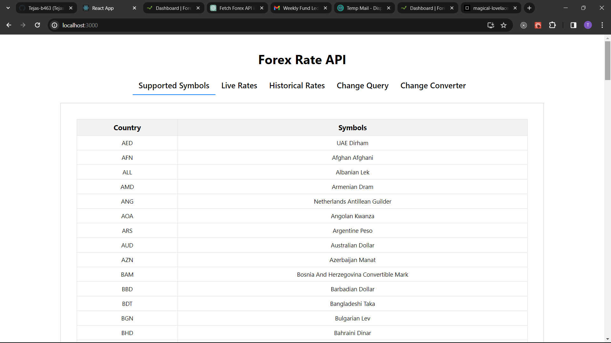
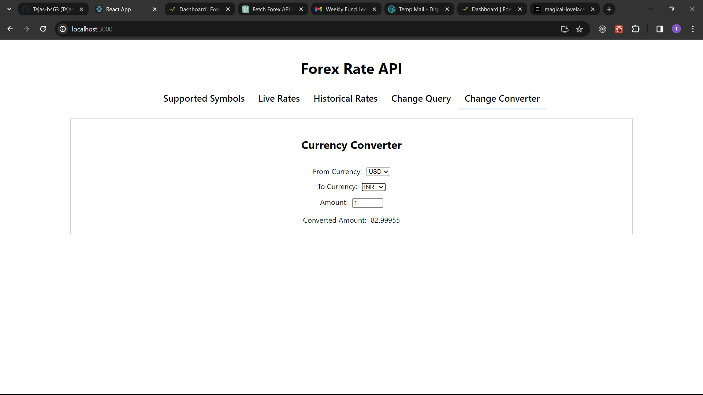
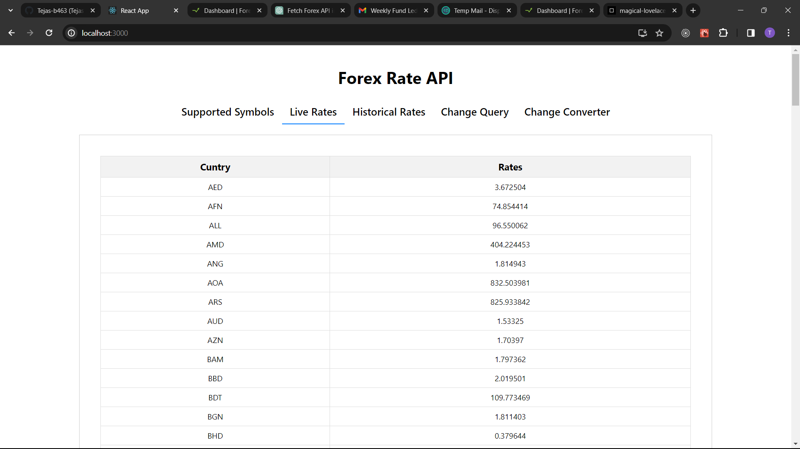

# Forex Rate API 🛍️

  
  
  

## Getting Started

Follow these instructions to set up and run the project locally on your machine.

### Prerequisites

- Node.js and npm installed on your system.

### Installation

1. Clone the repository: `git clone https://github.com/Tejas-b463/React.js-Task.git`
2. Navigate to the project directory: `cd InstantEats`
3. Install dependencies: `npm install`
4. Start the development server: `npm start`
